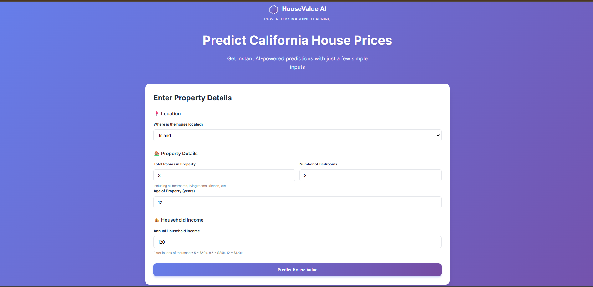
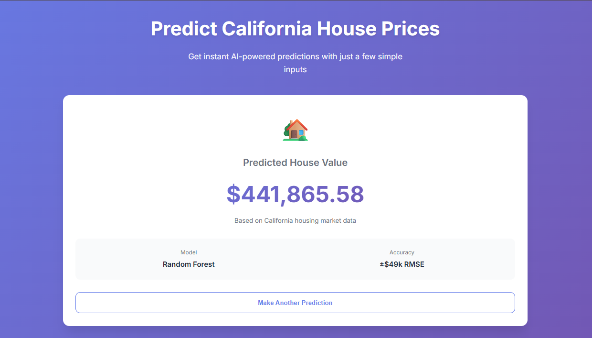

# 🏠 California House Price Predictor

A beautiful, AI-powered web application that predicts California house prices using machine learning.

[](https://www.python.org/)
[](https://flask.palletsprojects.com/)
[](https://scikit-learn.org/)
[](LICENSE)

## 🌟 Live Demo

**🔗 [Try it Live on Render](https://your-app-name.onrender.com)** *(Update this after deployment)*

## ✨ Features

- 🎯 **Accurate Predictions** - Random Forest model trained on 20,000+ California homes
- ⚡ **Instant Results** - Real-time predictions in milliseconds
- 🎨 **Beautiful UI** - Modern gradient design with smooth animations
- 📱 **Mobile Responsive** - Works perfectly on all devices
- 🔒 **Privacy First** - No data storage, all processing done on server

## 🖼️ Screenshots


*Simple and intuitive interface*


*Instant AI-powered predictions*

## 🚀 Quick Start

### Local Development

1. **Clone the repository**
```bash
git clone https://github.com/Ajit-programmer/House-Price-Prediction-model.git
cd House-Price-Prediction-model
```

2. **Install dependencies**
```bash
pip install -r requirements.txt
```

3. **Run the app**
```bash
python app.py
```

4. **Open your browser**
```
http://localhost:5000
```

## 📊 Model Performance

- **Algorithm**: Random Forest Regressor
- **RMSE**: $49,454 (10-fold cross-validation)
- **R² Score**: 0.8266
- **Training Data**: 16,512 California homes
- **Features**: 9 input features

## 🎯 Input Features

| Feature | Description | Example |
|---------|-------------|---------|
| **Location** | Ocean proximity | Near Ocean, Inland, etc. |
| **Total Rooms** | Number of rooms in property | 6 |
| **Bedrooms** | Number of bedrooms | 3 |
| **Property Age** | Age in years | 15 |
| **Household Income** | Annual income in $10k | 8.5 ($85,000) |

*Additional features (longitude, latitude, population, households) are auto-set to typical California values.*

## 🛠️ Tech Stack

### Backend
- **Flask** - Web framework
- **scikit-learn** - Machine learning
- **pandas** - Data processing
- **numpy** - Numerical computing
- **gunicorn** - Production WSGI server

### Frontend
- **HTML5/CSS3** - Structure and styling
- **Vanilla JavaScript** - Interactive functionality
- **Google Fonts (Inter)** - Typography

### Deployment
- **Render** - Cloud hosting platform
- **GitHub** - Version control

## 📁 Project Structure

```
House-Price-Prediction-model/
├── app.py                 # Flask application
├── model.pkl             # Trained ML model
├── pipeline.pkl          # Data preprocessing pipeline
├── requirements.txt      # Python dependencies
├── Procfile             # Render deployment config
├── .gitignore           # Git ignore rules
├── README.md            # This file
├── templates/
│   └── index.html       # Main HTML template
└── static/
    ├── css/
    │   └── style.css    # Styling
    └── js/
        └── script.js    # Client-side logic
```

## 🌐 API Endpoints

### `POST /predict`
Make a house price prediction.

**Request Body:**
```json
{
  "ocean_proximity": "NEAR BAY",
  "total_rooms": 6,
  "total_bedrooms": 3,
  "housing_median_age": 15,
  "median_income": 8.5,
  "longitude": -122.23,
  "latitude": 37.88,
  "population": 1400,
  "households": 500
}
```

**Response:**
```json
{
  "success": true,
  "prediction": 452600.0,
  "formatted_prediction": "$452,600.00"
}
```

### `GET /health`
Health check endpoint.

**Response:**
```json
{
  "status": "healthy",
  "model_loaded": true
}
```

## 🚀 Deployment to Render

### Prerequisites
- GitHub account
- Render account (free tier available)

### Steps

1. **Fork/Clone this repository**

2. **Push to GitHub** (if not already)
```bash
git add .
git commit -m "Ready for deployment"
git push origin main
```

3. **Deploy on Render**
   - Go to [render.com](https://render.com)
   - Click "New +" → "Web Service"
   - Connect your GitHub repository
   - Configure:
     - **Name**: `house-price-predictor`
     - **Environment**: `Python 3`
     - **Build Command**: `pip install -r requirements.txt`
     - **Start Command**: `gunicorn app:app`
   - Click "Create Web Service"

4. **Wait for deployment** (2-3 minutes)

5. **Access your app** at `https://your-app-name.onrender.com`

## 📈 Model Training

The model was trained using:
- California Housing Dataset
- Stratified train-test split (80-20)
- 10-fold cross-validation
- Random Forest with 100 estimators

**Training metrics:**
- Training RMSE: $27,109
- Test RMSE: $47,535
- Cross-validation RMSE: $49,454

## 🤝 Contributing

Contributions are welcome! Here's how you can help:

1. Fork the repository
2. Create a feature branch (`git checkout -b feature/AmazingFeature`)
3. Commit your changes (`git commit -m 'Add some AmazingFeature'`)
4. Push to the branch (`git push origin feature/AmazingFeature`)
5. Open a Pull Request

## 📝 Future Improvements

- [ ] Add more features (rooms per household, bedrooms per room)
- [ ] Implement confidence intervals
- [ ] Add interactive map visualization
- [ ] Historical price trends chart
- [ ] Batch predictions via CSV upload
- [ ] Model retraining pipeline
- [ ] A/B testing with different models

## 🐛 Known Issues

None currently. If you find any bugs, please [open an issue](https://github.com/Ajit-programmer/House-Price-Prediction-model/issues).

## 📄 License

This project is licensed under the MIT License - see the [LICENSE](LICENSE) file for details.

## 👤 Author

**Ajit**
- GitHub: [@Ajit-programmer](https://github.com/Ajit-programmer)
- Repository: [House-Price-Prediction-model](https://github.com/Ajit-programmer/House-Price-Prediction-model)

## 🙏 Acknowledgments

- California Housing Dataset
- scikit-learn documentation
- Flask community
- Render for free hosting

## 📞 Support

If you have any questions or need help, feel free to:
- Open an [issue](https://github.com/Ajit-programmer/House-Price-Prediction-model/issues)
- Contact via GitHub

---

**⭐ If you found this project helpful, please give it a star!**

Made with ❤️ and Python